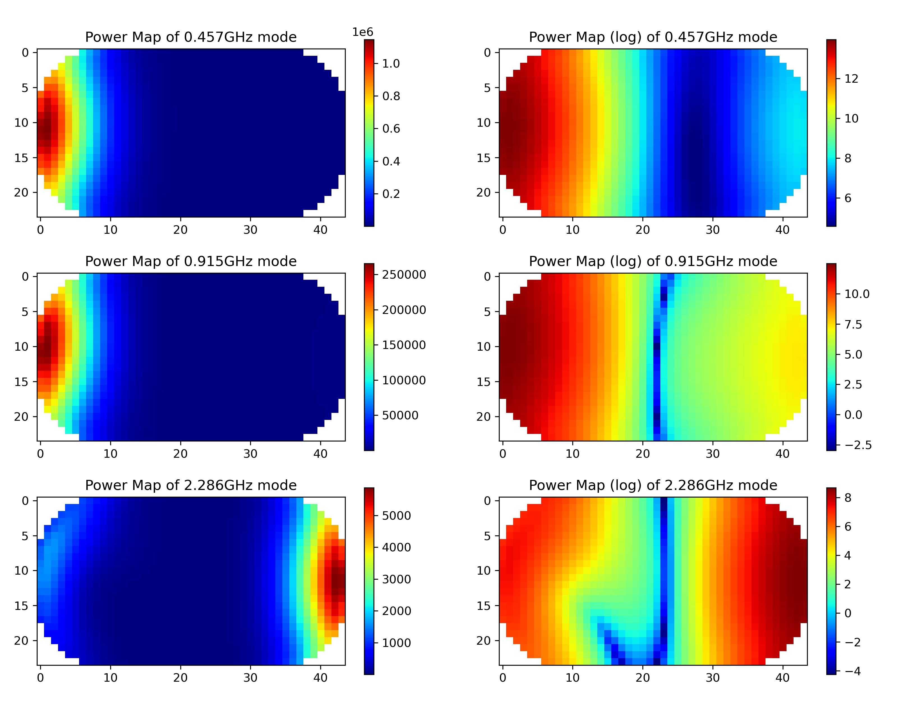
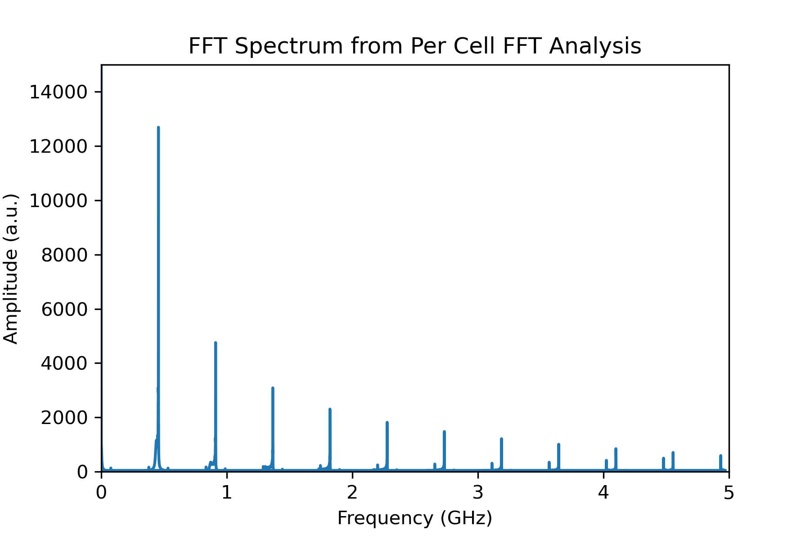
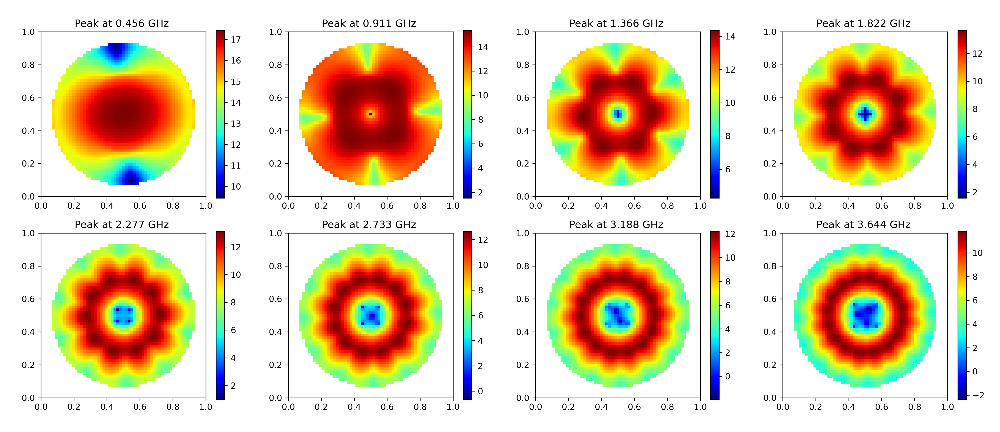

# Magnetism Analysis Tools

This repository contains scripts for converting micromagnetic simulation output files to numpy files. The supported file formats are OMF (from OOMMF) and OVF (from MuMax3).


The analysis tools provided in this repository contains a basic script that analysis the reduced magnetization readout from Mumax3 (OOMMF in progress).


But the main purpose of this code is what I call the per-cell FFT analysis. This involves extracting each cell in the simulation as a time series and performing FFT on it. The resulting heatmap indicates where a specific frequency of oscillation is taking place in the simulation (works on both the magnetization and the demagnetization field)


Example as found from my MSc thesis



TODO: Added an arguement to generate log scaled heatmap (but you can do it yourself by reading the npy file and plot it yourself)

## Installation

To use the per-cell analysis tools, you need to have Python installed on your system. You can install the required dependencies by running the following command:

```
pip install numpy matplotlib multiprocess tqdm
```


In addition, to use the FFT analysis of the magnetization, you will need scipy and pandas installed. If you haven't already, you can install them by running the following command:

```
pip install scipy pandas
```


## Usage

I don't yet have time to convert it into a python package. 
Please use it by cloning the repo to your working directory.

Also, by doing so, it provides flexibility to modify the code for your needs. For example, the code which reads the MuMax3 output txt file and carry out the FFT is 


```
git clone https://github.com/jedcheng/mumax_oommf_analysis
```

Example Working directory structure:
```
- analysis_tools
- Current_swep (folder containing .out folders)
    - J=1.mx3
    - J=2.mx3
    - prefix.txt

    - J=1.out
        m000000.ovf
        B_demag000000.ovf
        m_xrange15-40_yrange45-95_000000.ovf
        m_xrange35-85_yrange20-45_000000.ovf
        table.txt

    - J=2.out


    - M_FFT_output (automatically created from M_FFT.py)
        FFT_freq=J=1.png
        Reduced Magnetization of J=1.png
        J=1.txt (peaks of FFT)


    - npy (automatically created from convert_to_npy.py)
        - J=1_m
            output npy files
        - J=1_demag
            - output npy files
        - J=1_m_xrange15-40_yrange45-95_
            - output npy files
        - J=1_m_xrange35-85_yrange20-45_
            - output npy files


    - per_cell_output
```

If you want to convert cropped files from MuMax3, please include a prefix.txt like the following:

```
m_xrange15-40_yrange45-95_
m_xrange35-85_yrange20-45_
```


### FFT of Magnetization Readout (only for MuMax3)

At your working directory:

```
python analysis_tools/M_FFT.py \
    --simulation_name Current_swep/J=1 \
    --output_folder M_FFT_output \
    --target_freq_lower FFT_PLOT_X_LIM \
    --target_freq_upper FFT_PLOT_X_LIM \
    --no_regions NUMBER_OF_REGIONS_TO_ANALYZE 
```


Note:
1. Please don't include .out in the simulation name

2. I usually run the FFT immediately after each simulation on the HPC which the runtime is already in parallel. Therefore, I have not implemented parallelization in the FFT analysis. Please use a bash script to run the FFT analysis in parallel if you need to but it would be limited by the speed of your SSD.


### Per-cell FFT Analysis

First, you need to convert the OMF or OVF file to a numpy file. 


You can do this by running the following command at your working directory:

```
python analysis_tools/convert_to_npy.py \
    --no_files NUMBER_OF_FILES_TO_CONVERT \
    --no_cores NUMBER_OF_CORES_TO_USE \
    --data_folder Current_swep \
    --sim_name J=1 \
    --demag \ # if you want to convert demag field
    --cropped_files \ # if you want to convert cropped files
    --prefix_file prefix.txt 
```

This step is parallelized at the file level. Use bash script to loop through the parameter sweep folders to convert all the files. (i.e. J=1, J=2, J=3... one by one)


Then, you can run the per-cell FFT analysis by running the following command at your working directory:


```
python analysis_tools/per_cell_fft.py \
    --no_files NUMBER_OF_FILES_TO_CONVERT \
    --no_cores NUMBER_OF_CORES_TO_USE \
    --lower_index LOWER_INDEX_OF_FILES_TO_CONVERT \
    --upper_index UPPER_INDEX_OF_FILES_TO_CONVERT \
    --data_folder Current_swep \
    --sim_name J= \
    --output_dir per_cell_output \
    --cut_off FFT_PLOT_X_LIM_CUTOFF \
    --freq_spacing PEAKS_FREQ_SPACING \
    --demag \ # if you want to convert demag field
    --cropped_files \ # if you want to convert cropped files
    --prefix_file prefix.txt 
```


Note:
1. The parallelization is at sweep parameter level. Therefore, you can run the analysis for all the files in the parameter sweep folder at once. (i.e. J=1, J=2, J=3... all at once) The lower and upper index is used to specify which parameter sweep folders to analyze. (lower_index=1, upper_index=3 will analyze J=1, J=2, J=3)


2. It will load all numpy files into memory. Therefore, please make sure you have enough memory to load all the files. Otherwise decrease the number of cores to use.


3. When creating the heatmap, the program would identify the peaks in the FFT and only plot the peaks. The cut_off parameter is used to specify the maximum frequency to plot. (i.e. cut_off=0.5 will only plot the peaks with frequency less than 0.5). Otherwise, we will have a lot of heatmaps at high frequencies which are not useful. 

4. The freq_spacing parameter is used to specify the spacing between the peaks. ( freq_spacing=0.1e9 will plot the peaks with frequency 0.1GHz, 0.2GHz, 0.3GHz...). The purpose of this was to identify harmonic modes like these:




Again, please modify the code to suit your needs. 